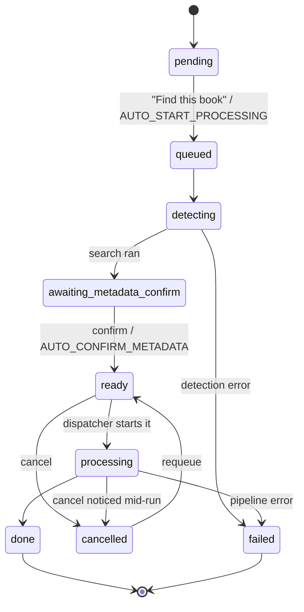

# Architecture

This document is for anyone changing the code, not deploying it — see
[README.md](README.md) for what the tool does and how to run it. It
covers how the pieces fit together and why they're built the way they
are, at a level no single file's own comments capture on their own.

## Processes

The container runs exactly two OS processes (see `entrypoint.sh`):

- **Web process** — `uvicorn app.main:app`. Serves the UI, and also runs
  the inbox watcher (`app/watcher.py`) as a background thread inside
  itself. See the docstring at the top of `app/main.py`.
- **Worker process** — the Huey consumer, `huey_consumer app.queue.huey`.
  Runs with a single worker thread (`-w 1`), so exactly one conversion
  ever executes at a time. This is deliberate, not a limitation to work
  around: a home server generally has one CPU/disk budget for encoding,
  and running one job at a time is what makes accurate progress
  reporting and clean cancellation tractable.

**They never talk to each other directly.** There's no queue client, no
socket, no shared memory — the only channel between them is the SQLite
database in `CONFIG_DIR`. The web process writes a job to "ready to
convert"; the worker process notices, converts it, and writes the
result back. Both sides just read and write rows.

This is why the database runs in **WAL mode** (`app/db.py`). SQLite's
default rollback-journal mode lets a connection's reads lag behind
another connection's already-committed writes until that connection
starts a fresh transaction — harmless for a single-process app, but it
meant the web process could serve a stale job status while the worker
was actively writing live progress to the same row. This was found by
testing against a real multi-hour conversion, not by inspection — the
staleness only showed up under genuine cross-process load. WAL is the
standard fix for this exact pattern.

## Job lifecycle

Every drop-off is one row in the `Job` table (`app/db.py`), moving
through a fixed set of statuses:



A separate `dismissed` boolean (not a status) can be set on a job in
almost any state, to hide it from the UI without deleting its row —
`app/db.py`'s comment on that field explains why deleting outright would
be a real bug (the watcher would re-detect the source file as new).

The web UI's three groups are just this state machine viewed at a
distance (`app/web/routes.py:_board_context`):

| Group | Statuses |
|---|---|
| Needs Input | `pending`, `queued`, `detecting`, `awaiting_metadata_confirm`, `failed`, `cancelled` |
| Converting | `ready`, `processing` |
| Done | `done` |

## The conversion queue

Confirming a job's metadata does **not** hand it to Huey. It just sets
`status=ready` and an incrementing `queue_order` (`app/queue.py:confirm_metadata`).
A separate function, `dispatch_next()`, is the only thing that ever
promotes a `ready` job to `processing` and enqueues it in Huey — and it
only does that when nothing else currently holds `processing`.

That indirection is the whole reason the queue can do things a raw Huey
queue can't:

- **Reordering** is a plain update to `queue_order` on rows Huey has
  never seen (`reorder_queue`) — not a queue-system operation.
- **Cancelling a job that hasn't started** is a plain status flip
  (`cancel_job`), for the same reason.
- **Cancelling the job that's actually running** can't work that way —
  it's mid-execution in the other process. `cancel_job` instead sets a
  `cancel_requested` flag; the running conversion's own progress loop
  polls that flag (see below) and stops itself.

`dispatch_next()` is called after every event that could free up or fill
the one processing slot — a confirm, a cancel, a requeue, or a job
finishing (in `process_job`'s `finally` block) — so the next queued job
starts on its own without anything polling for it.

## Conversion pipeline

`app/queue.py:process_job` is the orchestrator; each stage is one call
into `app/pipeline/`:

```
detect.detect()          -> which of the 3 input shapes, ordered audio files
metadata (already chosen by the time process_job runs)
convert.passthrough_m4b()      -- M4B input: copy untouched
  or convert.convert_mp3_to_m4b() -- MP3 input: transcode, with progress
chapters.resolve_chapters()    -> priority order, see below
ffutil.inject_chapters_ffmetadata()
tag.apply_tags()               -> MP4 atoms, see README's tag mapping
output.place_output()          -> standalone or library mode, naming templates
archive.handle_source_cleanup()
```

**Chapters** are resolved in priority order (`app/pipeline/chapters.py`):
embedded chapters already in an M4B input are left untouched; otherwise
audnexus's official chapter data for the matched title is used if
available; otherwise, for a multi-file MP3 source, each source file
becomes one chapter; otherwise (a single undifferentiated stream with no
better source) chapter breaks are inferred from silence via ffmpeg's
`silencedetect` filter. audnexus timestamps are for Audible's own
release and can run slightly past a given rip's actual duration, so
they're clamped to the real output duration before being written.

**Metadata search** goes through Audible's own unauthenticated catalog
API, not audnexus — audnexus turned out to have no free-text search of
its own (only ASIN lookup) when this was checked against its live API
during development, despite the original plan assuming it did. audnexus
is still used for the harmonized chapter data once a match is confirmed.
See the module docstring in `app/pipeline/metadata.py`.

## Live progress and cancellation

`app/pipeline/ffutil.py:transcode_to_aac_m4b` runs ffmpeg with
`-progress pipe:1` via `subprocess.Popen` instead of the blocking
`subprocess.run` used everywhere else in that module. Reading its stdout
line by line lets `_run_with_progress` do two things on every line:

- parse `out_time=` and report a percent complete via a callback
  (`Job.save_progress`, which does a narrow `save(only=[...])` so a
  frequent progress write can't clobber a field something else touched
  in between, like an appended log line);
- check a `should_cancel()` callback, and if it trips, terminate the
  ffmpeg subprocess and raise `CancelledError` — which `process_job`
  catches to delete the partial output file and mark the job
  `cancelled` rather than `failed`.

`should_cancel` re-reads `cancel_requested` from the database on every
call rather than trusting an in-memory flag, since the cancellation
request comes from the *other* process.

## Web UI

Server-rendered Jinja2, no JS framework or build step — see the comment
block at the top of `app/web/static/app.js` for the client-side model in
full. In short: the server is the only source of truth for a job's HTML;
the frontend's job is fetching small fragments and swapping them in.

- `GET /` renders the full page once.
- `GET /fragments/rail`, `/fragments/now-converting`, and
  `/fragments/panel/{id}` render the same partial templates standalone,
  for the frontend to re-fetch after an action.
- Only **one** job's detail panel ever exists in the DOM at a time,
  loaded on demand when you select it. Earlier iterations of this UI
  pre-rendered every job's panel up front and toggled visibility with
  CSS, which meant panels for jobs you weren't looking at could go
  stale after a reorder or a background status change (and would scale
  badly as job history grew). Fetching on demand removes the problem
  instead of managing it.
- A lightweight poll (`GET /api/status`, every 2.5s) patches progress
  numbers in place for the common case, and falls back to a full
  rail+panel refresh only when a job's status actually changes groups or
  the set of jobs changes.

Fonts (Spectral, IBM Plex Sans/Mono) are self-hosted static files under
`app/web/static/fonts/`, not a CDN dependency — this is a LAN tool that
should work without outbound internet for anything but the metadata
lookup itself.

## Directory map

```
app/
  config.py           env vars -> Config object (see .env.example for what each does)
  db.py               Job model, statuses, WAL setup
  watcher.py           inbox watcher (watchdog + settle-window polling)
  queue.py             Huey tasks + the dispatcher (see above)
  main.py               FastAPI app + lifespan (starts the watcher thread)
  pipeline/
    detect.py           which input shape, ordered audio files
    metadata.py          Audible search + audnexus chapters
    convert.py            bitrate decision, calls into ffutil
    ffutil.py              all ffmpeg/ffprobe subprocess calls
    chapters.py            chapter-source priority order
    tag.py                  MP4 atom writing
    output.py                naming templates, standalone/library placement
    archive.py                source cleanup + retention purge
  web/
    routes.py             all HTTP routes (see its module docstring)
    templates/             index.html + the _rail/_panel/_queue_item/_now_converting partials
    static/                app.js, style.css, fonts.css, fonts/
```

## Notable trade-offs

- **SQLite + peewee + Huey, not Postgres + Celery/Redis.** This is a
  single-user, one-job-at-a-time home server tool; adding a database
  server and a message broker would be pure overhead. WAL mode is the
  one accommodation SQLite needed for the two-process design above.
- **No built-in HTTPS/auth beyond optional HTTP Basic.** Deliberately
  scoped to a trusted LAN (see `WEB_UI_AUTH` in README) rather than
  hardening for internet exposure.
- **One Docker image, two processes via a shell entrypoint**, rather
  than two separate containers/services. Simpler to deploy (one image,
  one `docker compose up`) at the cost of both processes sharing
  restart/logging as a unit — acceptable at this scale, and
  `entrypoint.sh` is written so either process dying stops the
  container instead of leaving a half-working one behind.
