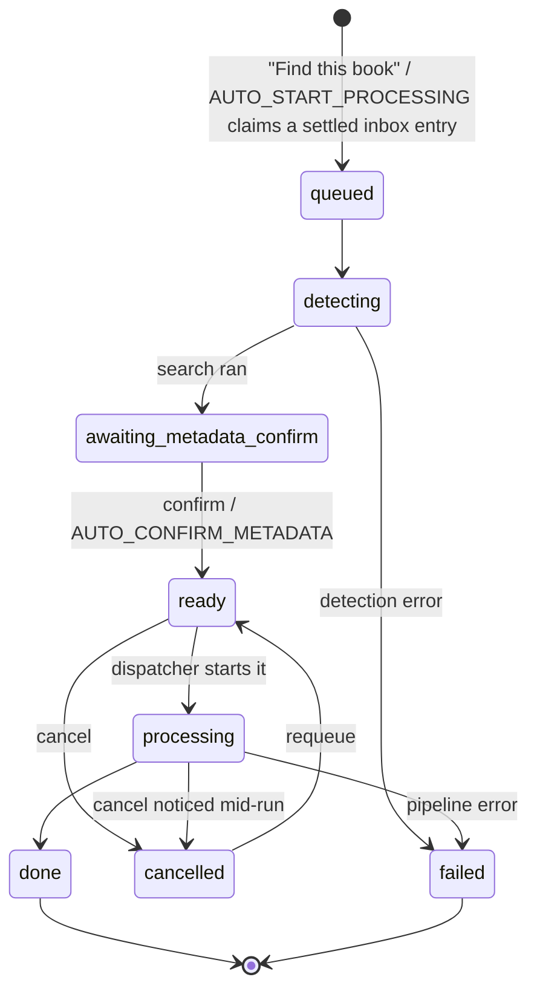

# Architecture

This document is for anyone changing the code, not deploying it — see
[README.md](README.md) for what the tool does and how to run it. It
covers how the pieces fit together and why they're built the way they
are, at a level no single file's own comments capture on their own.

## Processes

The container runs exactly three OS processes (see `entrypoint.sh`/`run.sh`):

- **Web process** — `uvicorn app.main:app`. Serves the UI, and also runs
  the inbox watcher (`app/watcher.py`) as a background thread inside
  itself. See the docstring at the top of `app/main.py`.
- **Conversion worker** — the Huey consumer for `app.queue.huey`, running
  `process_job`. Runs with a single worker thread (`-w 1`), so exactly
  one conversion ever executes at a time. This is deliberate, not a
  limitation to work around: a home server generally has one CPU/disk
  budget for encoding, and running one job at a time is what makes
  accurate progress reporting and clean cancellation tractable.
- **Lookup worker** — a second, separate Huey consumer for
  `app.queue.lookup_huey`, running `start_job` (format detection + the
  metadata search). Kept off the conversion worker's queue entirely:
  `start_job` normally finishes in under a second, but sharing a worker
  with `process_job` would leave a freshly-dropped book's lookup stuck
  behind an unrelated in-progress conversion for however long that
  conversion takes, with no way to tell "queued behind a conversion"
  apart from "stuck." The two Huey instances share one `huey.db` file
  (Huey namespaces rows by queue name), but never a worker thread.

**None of them talk to each other directly.** There's no queue client, no
socket, no shared memory — the only channel between them is the SQLite
database in `CONFIG_DIR`. The web process writes a job to "ready to
convert"; the conversion worker notices, converts it, and writes the
result back. The lookup worker notices newly-queued jobs the same way and
writes detection/candidate results back. All sides just read and write
rows.

This is why the database runs in **WAL mode** (`app/db.py`). SQLite's
default rollback-journal mode lets a connection's reads lag behind
another connection's already-committed writes until that connection
starts a fresh transaction — harmless for a single-process app, but it
meant the web process could serve a stale job status while the worker
was actively writing live progress to the same row. This was found by
testing against a real multi-hour conversion, not by inspection — the
staleness only showed up under genuine cross-process load. WAL is the
standard fix for this exact pattern.

**Schema changes and existing databases.** `init_db()` (`app/db.py`)
calls peewee's `create_tables([Job])`, which only *creates* the `job`
table if it doesn't exist yet — it never alters an already-existing one
to add columns for fields added to the `Job` model since. Left alone,
that would break any deployment upgrading from an older version: the
code would reference a column the on-disk table doesn't have. A small
`_add_missing_columns()` runs right after `create_tables()` on every
startup, diffing `Job`'s fields against `PRAGMA table_info()` and
issuing `ALTER TABLE ADD COLUMN` for anything missing — a no-op once a
column exists. Because both OS processes call `init_db()` independently
at startup, there's a narrow window where both could see the same
column missing before either adds it; whichever `ALTER`s second gets
SQLite's own "duplicate column name" error, which is swallowed rather
than left to crash that process, since the outcome either process
wanted (the column existing) is reached either way. This is
deliberately a single-table, additive-only check, not a general
migration framework — it only handles nullable/defaulted columns, the
same way `source_duration_sec` (see "Job lifecycle" below) was added.

## Job lifecycle

Every drop-off is one row in the `Job` table (`app/db.py`), moving
through a fixed set of statuses:



Before a `Job` row exists at all, a settled-but-unclaimed inbox entry is
tracked purely in memory by `app/watcher.py` (`list_pending()`,
`claim_pending()`) and rendered as a `PendingEntry` stand-in - see that
module's docstring. A `Job` only comes into existence at the moment
something claims the entry (`app/queue.py`'s `start_new_job()`), whether
that's a user clicking "Find this book" or `AUTO_START_PROCESSING`
claiming it automatically. This means a file moved or deleted directly
through the filesystem before being claimed is never orphaned: there's no
row to go stale, since nothing was ever persisted for it.

A separate `dismissed` boolean (not a status) can be set on a job in
almost any state, to hide it from the UI without deleting its row -
`app/db.py`'s comment on that field explains why. This only matters for a
job that's already been claimed (see above) - an unclaimed entry has no
row to dismiss; removing one before it's ever looked up just cleans up
its source file directly (`app/web/routes.py`'s `pending:` branch of
`/jobs/{id}/remove`) with nothing left to hide.

Another separate, informational-only field: `source_duration_sec`, the
sum of `ffutil.get_duration_sec()` across a job's audio files, computed
once in `start_job()` right after `detect.detect()` succeeds. It exists
purely so the metadata review step can show the source's actual runtime
next to a candidate's official one (`app/pipeline/metadata.py`'s
`runtime_minutes`) — a quick way to spot a mismatched edition (e.g. an
abridged match against an unabridged source) before confirming, rather
than only discovering it after conversion.

The web UI's three groups are just this state machine viewed at a
distance (`app/web/routes.py:_board_context`):

| Group | Statuses |
|---|---|
| Needs Input | unclaimed `PendingEntry` stand-ins (rendered with status `pending`, but not a real `Job` status - see above), `queued`, `detecting`, `awaiting_metadata_confirm`, `failed`, `cancelled` |
| Converting | `ready`, `processing` |
| Done | `done` |

## The conversion queue

Confirming a job's metadata does **not** hand it to Huey. It just sets
`status=ready` and an incrementing `queue_order` (`app/queue.py:confirm_metadata`).
A separate function, `dispatch_next()`, is the only thing that ever
promotes a `ready` job to `processing` and enqueues it in Huey — and it
only does that when nothing else currently holds `processing`.

That indirection is the whole reason the queue can do things a raw Huey
queue can't:

- **Reordering** is a plain update to `queue_order` on rows Huey has
  never seen (`reorder_queue`) — not a queue-system operation.
- **Cancelling a job that hasn't started** is a plain status flip
  (`cancel_job`), for the same reason.
- **Cancelling the job that's actually running** can't work that way —
  it's mid-execution in the other process. `cancel_job` instead sets a
  `cancel_requested` flag; the running conversion's own progress loop
  polls that flag (see below) and stops itself.

`dispatch_next()` is called after every event that could free up or fill
the one processing slot — a confirm, a cancel, a requeue, or a job
finishing (in `process_job`'s `finally` block) — so the next queued job
starts on its own without anything polling for it.

## Conversion pipeline

`app/queue.py:process_job` is the orchestrator; each stage is one call
into `app/pipeline/`:

```
detect.detect()          -> which of the 3 input shapes, ordered audio files
metadata (already chosen by the time process_job runs)
convert.passthrough_m4b()      -- M4B input: copy untouched
  or convert.convert_mp3_to_m4b() -- MP3 input: transcode, with progress
chapters.resolve_chapters()    -> priority order, see below
ffutil.inject_chapters_ffmetadata()
tag.apply_tags()               -> MP4 atoms, see README's tag mapping
output.place_output()          -> standalone or library mode, naming templates
archive.handle_source_cleanup()
```

**Chapters** are resolved in priority order (`app/pipeline/chapters.py`):
embedded chapters already in an M4B input are left untouched *if* the file
already carries a QuickTime-style chapter track (`ffutil.
has_quicktime_chapter_track`) alongside the legacy Nero `chpl` atom -
otherwise the same chapter data is re-injected through
`ffutil.inject_chapters_ffmetadata()` to add the missing track. This
matters because Apple's own apps (Books, Music, Podcasts, QuickTime) need
that QuickTime track specifically to show real chapter *titles*; lacking
it, they still get the right chapter *count* but fall back to generic "1",
"2", "3" numbering - a real, silent gap some other/older ffmpeg-based
tooling can leave in a source .m4b, which `ffprobe`'s chapter list can't
tell apart from a fully-correct file. Otherwise (no usable embedded
chapters), audnexus's official chapter data for the matched title is used
if available - **realigned against this rip's actual audio first**, see
below; otherwise, for a multi-file MP3 source, each source file becomes
one chapter; otherwise (a single undifferentiated stream with no better
source) chapter breaks are inferred from silence via ffmpeg's
`silencedetect` filter.

**Priority-2 (audnexus) chapter realignment.** audnexus's chapter
timestamps are anchored to Audible's own official release, which commonly
has different front/back matter (a branded intro, "Audible Studios
presents...", an outro) than a given local rip. Writing them verbatim
used to land chapter navigation slightly after a chapter had actually
begun - and, critically, the drift turned out not to be a single constant
offset per book (an empirical investigation against 73 real,
human-verified books found a median *internal* spread of ~16s within one
book alone), so a single global correction can't fix it; each chapter
needs to be individually re-anchored to the real audio.

A real-world test against a 28.6-hour, 52-file mp3_multi audiobook (69
audnexus chapters) surfaced two further problems the algorithm below alone
doesn't solve: some narrations have no long pauses *anywhere* (every
detected silence in that book capped at 4.55s, stable across three
different `silencedetect` thresholds - a genuine property of the
recording, not a threshold-tuning problem), starving the aligner's
confident tier of anything to anchor on; and a meaningful fraction of a
book's "chapters" (23% in that book) are actually ~2s POV-character-name
markers ("Meg", "Birdie" alternating) with no acoustic boundary of their
own, which the aligner was trying and failing to place as if they were
ordinary chapters. `_align_audnexus_chapters` (`app/pipeline/chapters.py`)
is the refined pipeline that responds to both, wrapped around the
aligner rather than changing it:

1. **Short-chapter folding**, before alignment ever runs. Any audnexus
   chapter whose own reported length (`end_sec - start_sec`, itself from
   audnexus's `lengthMs`) is under 5s is dropped from the list the aligner
   sees, and its title folded onto the chapter immediately following it -
   `"{short title} — {next title}"` (or onto the *preceding* chapter if
   it's the last one in the book, so a title is never silently dropped).
   A chapter's own length is the signal, not its distance to a neighbour:
   a real 8s "Dedication" chapter must survive; a 2s "Meg" marker must
   not, regardless of how far away the surrounding chapters happen to
   sit. This alone removes the name-marker chapters from the alignment
   problem entirely, rather than asking the aligner to place something
   that was never going to have its own silence.
2. **Alignment**, unchanged - the achew `ChapterAligner` (below) runs
   against this cleaned, shorter list.
3. **A verified confidence gate**, rather than trusting every placement
   the aligner returns. achew's `confidence` field turned out (confirmed
   directly against achew's own `_build`/`_result` methods, the exact
   commit this port is from) to be a fixed, small set of tier constants -
   1.0 for the forced chapter-0 anchor, 0.85 for a confident skeleton
   match, 0.35 for a fill, 0.25 for a fully-interpolated guess - not a
   continuous score, with `is_guess` set to exactly `not confident` in
   every case. So `is_guess is False` (already computed and returned by
   the aligner) *is* the right gate, with no separate numeric threshold
   needed.
4. **File-boundary anchoring**, a second-line source of ground truth for
   an otherwise-unconfident chapter, only for `mp3_multi` sources. Once
   per book: skip entirely unless the source's file count sits within ~2
   of the *cleaned* chapter count (comparing against the raw, marker-
   inflated count would almost never match even a genuine
   one-file-per-chapter rip). Try pairing chapters to files in both
   directions - front-anchored (chapter 0 ↔ file 0, walking forward,
   excess trimmed off the back) and back-anchored (the last chapter ↔ the
   last file, walking backward, excess trimmed off the front) - since the
   extra, unmatched files/chapters could plausibly sit at either end (an
   unripped intro, or unsplit bonus/back-matter content). For each
   direction, compute the shift (a paired file's real, `ffprobe`-measured
   start boundary minus that chapter's own audnexus reference timestamp)
   for every paired chapter, bucket the shifts to the nearest second, and
   accept the direction only if ~80% of paired chapters land in the same
   bucket - a large, tight majority is strong evidence these files really
   do correspond 1:1 to these chapters, not a coincidental count match.
   Whichever direction clusters tighter wins; a tie (or both equally
   weak) defaults to back-anchored, matching front-matter mismatches
   being the more commonly observed pattern in the investigation this
   responds to. If neither direction clusters, file-boundary anchoring is
   rejected for the whole book. A verified chapter's position is its own
   real file boundary directly - the consensus shift's role is entirely
   to decide whether to *trust* the pairing, not to further adjust an
   already-accurate, individually-measured position.
5. **Fold rather than fabricate.** Per cleaned chapter, in order: use
   achew's placement if confident; otherwise use a verified file-boundary
   position if one exists for this chapter; otherwise fold this
   chapter's title onto the PRECEDING resolved chapter (achew- or
   file-boundary-placed) - backward rather than forward, unlike step 1.
   The direction matters: a marker's span is always [its own position, the
   next resolved marker's position), so an unresolved chapter's real audio
   already falls inside whichever resolved span precedes it, not the one
   that follows - folding forward would attach the compound title to a
   marker positioned well past the content it claims to describe. Unlike
   step 1's em-dash chaining, this fold collapses to an en-dash *range* -
   "{anchor's own title} – {last folded title}" - recomputed fresh from
   the anchor's own original title each time another chapter folds in,
   rather than accumulated onto whatever the title currently is. A run of
   many consecutive unresolved chapters is common on books with little
   usable silence to anchor on, and chaining every one of their titles
   onto the anchor (as step 1 does, and as this step itself used to do)
   produces an unreadably long wall of text; the en dash also keeps this
   kind of join visually distinct from step 1's em dash. E.g. chapters
   22-35 all unresolved between resolved chapters 21 and 36 fold into one
   marker titled "Chapter 21 – Chapter 35" at chapter 21's own position
   (spanning [P21, P36)); chapter 36 keeps its own untouched title and
   position. No chapter is ever written from a raw, un-realigned audnexus
   timestamp or a scale-interpolated guess; a chapter with no verified
   placement gets no marker of its own rather than a smoothly-drifting,
   fabricated one. Chapter 0 is always achew-confident (the aligner
   anchors it at 0.0 unconditionally), so there's always at least one
   resolved chapter already in hand to fold onto.

`app/pipeline/chapter_aligner.py` is a port of
[achew](https://github.com/SirGibblets/achew)'s `ChapterAligner`
(MIT licensed, © 2025 Sir Gibblets - see `/NOTICE.md` for the full license
text and the itemized diff from upstream in that file's header comment) -
step 2 above. `app/pipeline/chapters.py`'s `_align_audnexus_chapters`
drives it: a single whole-file `ffutil.run_silencedetect()` pass over the
converted output (the same ffmpeg filter priority-4 uses, for a different
purpose - turning silences into chapter *breaks* directly - here they
become candidate *cues* to match chapters against) supplies the raw
silences, each converted to a `(timestamp, gap)` cue the same way achew
itself does (`DetectedCue.from_silences`: the cue sits 1/3s before the
silence ends, `gap` is the silence's duration). Because this runs as a
background batch job rather than an interactive tool, it can afford to
scan the *whole* file up front - `scanned_regions` is always the entire
duration - which sidesteps achew's own windowed-scan/expansion-retry
mechanism entirely (a genuine simplification over achew's own usage).

The matching algorithm itself (unchanged from achew) works in three
tiers, matching the *relative spacing* between audnexus's chapters to the
relative spacing between detected cues rather than absolute position -
which is what makes it immune to a constant front-matter offset and to
per-chapter jitter, instead of needing to know that offset in advance:

1. **Skeleton** - a monotonic dynamic-programming match of chapters to
   only the *strongest* cues (roughly one per chapter, by silence
   duration), scored mostly on duration-shape (does the gap between two
   matched cues match the gap between the corresponding audnexus
   chapters?) with a weak absolute-position prior and a gap-strength
   tie-breaker. The DP's time-base scale is the book/audnexus duration
   ratio, re-estimated once via a robust (Theil-Sen) slope through the
   skeleton's own matches if that disagrees with the ratio (which happens
   when the duration difference is concentrated in front/trailing content
   rather than spread evenly across chapters). These placements are the
   **confident** tier and are never moved by the later tiers.
2. **Fill** - the skeleton leaves gaps (a weak true boundary that never
   made the "strongest cues" cut, or one sitting behind a regional
   offset the skeleton's position prior penalized away). Each gap gets a
   second, local duration-shape DP over the *full* cue set, bracketed by
   the confident chapters on either side - anchoring on real bracket
   times absorbs a regional offset a single global pass couldn't. These
   placements are flagged as lower-confidence **guesses**.
3. **Polish** - fills can land shape-correct but a couple of seconds off,
   parked on an equally-consistent parallel decoy chain. Each guess
   bracketed on both sides is re-snapped to the real cue nearest its
   straddling-neighbour interpolation, within a small window.

A chapter with no acceptable cue anywhere nearby is scale-interpolated
between its placed neighbours and flagged `is_guess` rather than forced
onto a wrong cue - but as of the refined pipeline above, that
interpolated position is never itself written: an unconfident chapter is
either rescued by file-boundary anchoring or folded onto a neighbour (see
step 5). On achew's own 73-book real-fixture regression set, the
algorithm still places ~97% of matchable chapters within 0.1s of the
human-verified boundary; this project's own ported copy of that fixture
suite (`tests/unit/test_chapter_aligner.py`) measured 97.10% at
calibration time.

Every stage of this is logged via `job.append_log()` (chapters resolve at
~92% of conversion progress, after the metadata-confirm review step, so
there's no natural checkpoint for a manual confirmation gate without a
larger re-architecture): how many chapters were folded for being short,
how many achew placed confidently, how many file-boundary anchoring
placed (and which direction, if used), how many were folded for lacking
any verified placement, and the median/max shift among achew's own
placements - enough that job history alone tells you which path every
chapter took, without reading code.

`_clamp_to_duration()` - which used to be the *only* correction applied to
audnexus's chapters (dropping any chapter starting past the actual
output's duration, clamping the last one's end to fit) - is still applied
after alignment, but now purely as a defensive backstop: the aligner's own
placements are already bounded by real detected cues or by
scale-interpolation clamped to the book, so a chapter starting past the
file's end shouldn't occur any more. The clamp costs nothing to keep and
guards against a bug (or a future change to the aligner) writing chapter
metadata past the end of the file, which would otherwise corrupt the
M4B's chapter atom - it's no longer the primary correction mechanism.

**A corrupt source file** (e.g. a truncated or otherwise unreadable MP3)
is caught by `start_job()`'s existing per-file duration probe
(`ffutil.get_duration_sec`), which already runs right after
`detect.detect()` and before the metadata search - every source file's
header has to be probed there anyway, to compute the book's total
duration for the review step (see "Job lifecycle" above). A file ffprobe
can't parse at all raises there, failing the job before any API call, UI
review time, or transcode work is spent on a book that was never going to
convert; the failure message names the corruption explicitly rather than
surfacing a raw ffprobe stderr dump. An earlier version of this fix added
a second, stricter check - a full decode pass right before transcoding,
meant to catch corruption inside an otherwise-valid-looking file that the
header probe can't see - but real-world testing found it caused more harm
than it prevented: concatenating a file with a harmless, fully-recoverable
mid-stream decode hiccup through the actual production transcode command
produced a correct, undamaged book (verified directly - correct audio,
correctly positioned, at every timestamp checked), while the stricter
check would have rejected that same book outright, since it aborts on the
first decode error regardless of whether the real transcode can recover
from it. It was reverted; the existing header-only check above is what
ships.

**Metadata search** goes through Audible's own unauthenticated catalog
API, not audnexus — audnexus turned out to have no free-text search of
its own (only ASIN lookup) when this was checked against its live API
during development, despite the original plan assuming it did. audnexus
is still used for the harmonized chapter data once a match is confirmed.
See the module docstring in `app/pipeline/metadata.py`.

## Live progress and cancellation

`app/pipeline/ffutil.py:transcode_to_aac_m4b` runs ffmpeg with
`-progress pipe:1` via `subprocess.Popen` instead of the blocking
`subprocess.run` used everywhere else in that module. Reading its stdout
line by line lets `_run_with_progress` do two things on every line:

- parse `out_time=` and report a percent complete via a callback
  (`Job.save_progress`, which does a narrow `save(only=[...])` so a
  frequent progress write can't clobber a field something else touched
  in between, like an appended log line);
- check a `should_cancel()` callback, and if it trips, terminate the
  ffmpeg subprocess and raise `CancelledError` — which `process_job`
  catches to delete the partial output file and mark the job
  `cancelled` rather than `failed`.

`should_cancel` re-reads `cancel_requested` from the database on every
call rather than trusting an in-memory flag, since the cancellation
request comes from the *other* process.

## Web UI

Server-rendered Jinja2, no JS framework or build step — see the comment
block at the top of `app/web/static/app.js` for the client-side model in
full. In short: the server is the only source of truth for a job's HTML;
the frontend's job is fetching small fragments and swapping them in.

- `GET /` renders the full page once.
- `GET /fragments/rail`, `/fragments/now-converting`, and
  `/fragments/panel/{id}` render the same partial templates standalone,
  for the frontend to re-fetch after an action.
- `POST /jobs/{id}/search` re-runs the metadata search with user-supplied
  title/author terms (for when the filename-derived guess was a bad
  match) and returns the re-rendered `_candidates.html` fragment
  directly, which `app.js` swaps in place — the one `POST /jobs/{id}/...`
  route that doesn't just return `{"ok": true}`. `_candidates.html` and
  `_chapters.html` are both factored out of `_panel.html` into their own
  partials specifically so their markup (candidate data, including
  `asin` — see the "asin" comment in `_candidates.html` for why that
  matters — and the chapter-preview list) is defined in exactly one
  place, included everywhere it's needed instead of duplicated per job
  status. `_candidates.html` also renders a "None of these" opt-out row
  after the real results whenever any exist, so a wrong-but-plausible
  match doesn't have to be picked (or edited over) just to get to manual
  entry; app.js resets the confirm form's fields to job.title_guess /
  job.author_guess (blank asin included) when it's clicked, the same
  no-candidate-chosen state the confirm form already defaults to when
  there are no candidates at all.
- Only **one** job's detail panel ever exists in the DOM at a time,
  loaded on demand when you select it. Earlier iterations of this UI
  pre-rendered every job's panel up front and toggled visibility with
  CSS, which meant panels for jobs you weren't looking at could go
  stale after a reorder or a background status change (and would scale
  badly as job history grew). Fetching on demand removes the problem
  instead of managing it.
- A lightweight poll (`GET /api/status`, every 2.5s) patches progress
  numbers and the top-right status pill's counts in place for the common
  case, and falls back to a full rail+panel refresh only when a job's
  *render group* changes or the set of jobs changes. Render group, not raw
  status: a small map in `app.js` collapses statuses that render
  byte-identical HTML in `_panel.html`/`_queue_item.html` (currently just
  `queued` and `detecting`, both "Looking it up…") into one group, so the
  near-instant background `queued` → `detecting` transition doesn't cause
  a purely-cosmetic reload. Action buttons (start/cancel/requeue/remove/
  confirm/reorder) already trigger their own immediate refresh on click,
  which would otherwise leave the poller's tracked baseline stale and
  force a redundant second reload on the very next tick — each handler
  resyncs that baseline from the DOM right after its own refresh settles
  to avoid it. Every fragment swap (panel/rail/now-converting) is wrapped
  in the View Transitions API when the browser supports it, so a real
  reload cross-fades instead of popping; unsupported browsers just get an
  instant swap as before.
- `GET /api/summary` is a separate, external-facing read endpoint: aggregate
  queue counts (`needs_input`/`converting`/`done`, using the exact same
  groupings as `_board_context()`) plus the currently-processing job's
  title/progress/stage, if any. It exists for the homepage dashboard
  integration (a Custom API widget configured outside this repo, in
  homepage's own `services.yaml`) rather than for this app's own UI, which
  keeps using `/api/status`'s per-job rows.

Fonts (Spectral, IBM Plex Sans/Mono) are self-hosted static files under
`app/web/static/fonts/`, not a CDN dependency — this is a LAN tool that
should work without outbound internet for anything but the metadata
lookup itself.

## Directory map

```
app/
  config.py           env vars -> Config object (see .env.example for what each does)
  db.py               Job model, statuses, WAL setup, startup column migration
  watcher.py           inbox watcher (watchdog + settle-window polling)
  queue.py             Huey tasks + the dispatcher (see above)
  main.py               FastAPI app + lifespan (starts the watcher thread)
  pipeline/
    detect.py           which input shape, ordered audio files
    metadata.py          Audible search + audnexus chapters
    convert.py            bitrate decision, calls into ffutil
    ffutil.py              all ffmpeg/ffprobe subprocess calls
    chapters.py            chapter-source priority order
    tag.py                  MP4 atom writing
    output.py                naming templates, standalone/library placement
    archive.py                source cleanup + retention purge
  web/
    routes.py             all HTTP routes (see its module docstring)
    templates/             index.html + the _rail/_panel/_queue_item/_now_converting/
                            _candidates/_chapters partials
    static/                app.js, style.css, fonts.css, favicon.svg, fonts/
```

## Notable trade-offs

- **SQLite + peewee + Huey, not Postgres + Celery/Redis.** This is a
  single-user, one-job-at-a-time home server tool; adding a database
  server and a message broker would be pure overhead. WAL mode is the
  one accommodation SQLite needed for the multi-process design above.
- **No built-in HTTPS/auth beyond optional HTTP Basic.** Deliberately
  scoped to a trusted LAN (see `WEB_UI_AUTH` in README) rather than
  hardening for internet exposure.
- **One Docker image, three processes via a shell entrypoint**, rather
  than separate containers/services. Simpler to deploy (one image, one
  `docker compose up`) at the cost of all three processes sharing
  restart/logging as a unit — acceptable at this scale, and
  `entrypoint.sh`/`run.sh` are written so any one process dying stops
  the container instead of leaving a half-working one behind.
